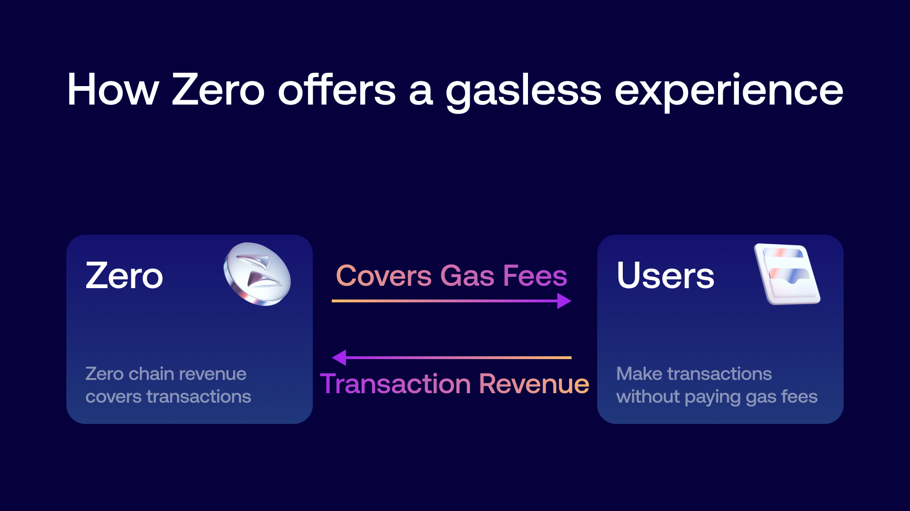

Zero offers a completely gasless experience to onchain users.

Although gas fees are important for network security, they act as a major barrier for true large-scale adoption by creating complexity for users who just want to start doing things on dapps.

Like on any other L2, transactions on Zero have two costs: the execution costs on the L2 and the costs of posting the rollup batch to L1. Most existing L2s pass both costs on to the end user, which means that every transaction has a dynamic gas fee. Even if gas fees have become lower, they can still become substantial during periods of peak activity on Ethereum. 

Here’s how Zero solves this:

Zero users do not have to worry about gas as it is fully covered by a self-sustainable flywheel. The flywheel uses Zero’s revenue to cover gas for users. The system is different from gas subsidy programs as those often have a limit. Zero’s revenue generation removes that constraint and sets the system up for long-term success.

This novel mechanism is also more beneficial than gas refunds as it removes the need to monitor native token balances entirely and lets users focus on their onchain activity.  As it is a zK rollup, the cost of each L2 transaction on Zero declines as the network scales and more transactions are included in a single batch on L1. This means that the system becomes increasingly more scalable as it grows. 

The network remains secure as fees are still technically required for transactions to be processed- but these fees are not felt by the user. We are also building automated measures and checks that help Zero mitigate the impact of spam transactions and other attempts to overwhelm the network. This will be called [redacted].

## Sybil Resistance

To ensure the fair distribution of free transactions and prevent abuse, Zero employs a dynamic scoring system to evaluate wallet addresses. Initially, our approach is straightforward, using Total Value Locked (TVL) as the primary metric. Wallets with higher TVL benefit from a faster rate of accumulating charges, which are the credits used for free transactions on Zero Network.

<aside>
💳 Every wallet accrues charges at a rate determined by its characteristics, such as TVL.
</aside>