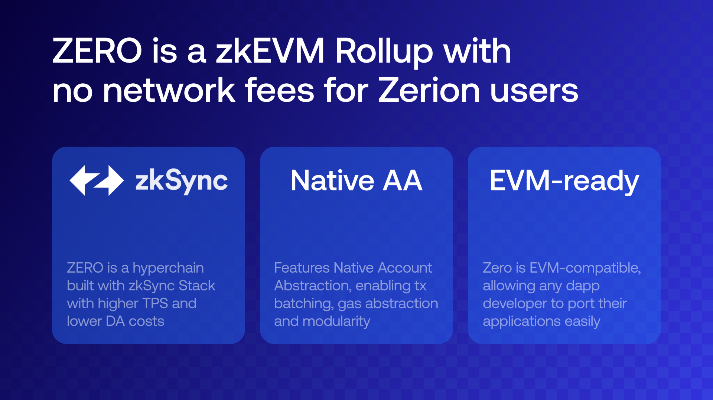

# Overview

**ZERϴ Network** is the first EVM-compatible rollup that eliminates the need for gas entirely within the network. This solves one of the main blockchain roadblocks and elevates the UX to a new level for both existing users and newcomers.

ZERϴ is a general purpose rollup that is home to a vibrant and ever-growing ecosystem.

---

ZERϴ Network is a permissionless general-purpose Layer 2 leveraging zkSync Hyperchain’s zk rollup technology to offer fast and gasless transactions. It is censorship-resistant and open to all dApp developers.

::: info
ZERϴ does not require users to pay gas which means that dApps can offer new experiences where more interactions are onchain and yet feel as smooth as Web2 ones.
:::

### Building on ZERϴ

ZERϴ is an EVM-compatible chain which means that dApps can be ported from the Ethereum mainnet or L2 networks. This opens up opportunities for chain expansion to existing applications and the ZERϴ ecosystem will feature some of the largest dapps in crypto.

Developers are encouraged to leverage Zerion’s world-class [API](https://developers.zerion.io/). It offers access to real-time onchain data on transactions, wallet balances, NFTs and more.

Interested in building on ZERϴ? Zerion will be happy to support you through our dedicated grant program. Fill out this form to express interest and we’ll be in touch: link
